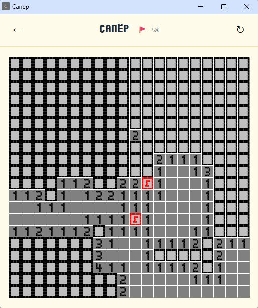
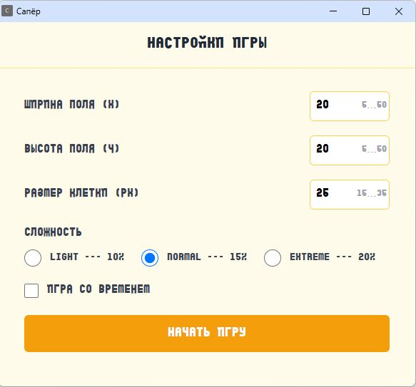

# Сапер (Minesweeper)

 Классическая игра "Сапер" в виде расширения для браузера Chrome.  
 Написана на React + TypeScript, стилизована под ретро-дизайн с пиксельными спрайтами.

<p align="center">
  
</p>
<p align="center">
  
</p>

## Установка и запуск

1. Клонируйте репозиторий
   ```bash
   git clone https://github.com/anatolka18/minesweeper.git
   cd minesweeper
   ```

2. Установите зависимости
   ```bash
   npm install
   ```

3. Соберите расширение
   ```bash
   npm run build
   ```

4. Загрузите в Chrome
   Откройте chrome://extensions. 
   Включите **Режим разработчика** (Developer mode). 
   Нажмите **Загрузить распакованное расширение** и выберите папку `dist`. 

## Как играть

- Левый клик - открыть клетку.
- Правый клик - поставить/снять флажок.
- Цель - Открыть все клетки без мин.

В настройках можно:
- Изменить размер поля и клеток.
- Выбрать уровень сложности (процент мин).
- Включить таймер обратного отсчёта.

## Стек технологий

- React 18
- TypeScript
- Vite
- Tailwind CSS
- Chrome Extensions API (Manifest V3)
- Пиксельные спрайты через Canvas (битовые маски)

---
